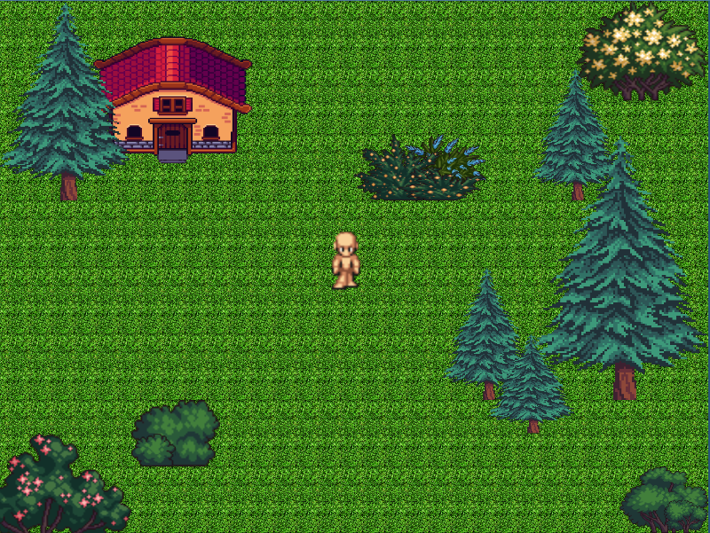

# TileWord-2D

A 2D tile-based game built on a **custom engine** designed for **high performance** and **compatibility** with low-end PCs and multiple operating systems, including **Windows Vista and later, macOS, Linux, and OpenBSD**.

## Screenshots


*TileWord-2D gameplay showing the tile-based world and character movement*

## Features

- **Tile-based grid rendering** with 16x16 tiles
- **Simple movement controls** using WASD keys only
- **Custom level format** loaded from `.txt` files with simple syntax
- **Cross-platform compatibility** supporting Windows Vista+, macOS, Linux, and OpenBSD
- **High performance** optimized for low-end hardware
- **OpenGL rendering** with texture caching using `stb_image`
- **Portal system** for seamless level transitions
- **Animated entities** with sprite-based animation
- **Collision detection** with optimized hitbox system
- **Configurable resolution** through `Variable.hpp`
- **Lightweight architecture** suitable for older hardware
- **Demo-oriented gameplay** focused on exploration

## Dependencies

- **OpenGL** - Graphics rendering
- **GLFW** - Window management and input handling
- **GLEW** - OpenGL extension loading
- **STB Image** - Image loading (included)
- **C++17 or later** - Tested with C++17, may work with earlier versions

## Building

Ensure you have the required dependencies installed:

```bash
# Ubuntu/Debian
sudo apt-get install libglfw3-dev libglew-dev

# macOS (with Homebrew)
brew install glfw glew

# Windows
# Download and install GLFW and GLEW manually or use vcpkg
```

Build using the included Makefile:

```bash
make
```

Or compile manually:

```bash
g++ -std=c++17 main.cpp -lglfw -lGLEW -lGL -o tileworld
```

## System Requirements

**Minimum:**
- OpenGL 2.1 support
- 512MB RAM
- Hardware from approximately 2005 or newer
- Windows Vista or later / macOS 10.9+ / Linux with X11 / OpenBSD
- Any graphics card with basic OpenGL support

**Recommended:**
- OpenGL 3.0+ support
- 1GB RAM
- Dedicated graphics card for optimal performance

The engine is specifically designed for **maximum compatibility** across different operating systems and hardware generations, ensuring it runs smoothly on vintage computers while maintaining modern OS support.

## Project Structure

```
├── main.cpp              # Main game loop and initialization
├── Variable.hpp          # Configuration constants and resolution settings
├── TextureLoader.hpp     # Texture loading and rendering utilities
├── GameManager.hpp       # Core game logic and level management
├── levels/              # Level definition files
│   ├── exterior.txt     # Starting level
│   └── ...              # Additional levels
└── texture/             # Game textures
    ├── block/           # Tile textures
    ├── decoration/      # Decoration textures
    └── char_a_p1/       # Character sprites
```

## Configuration

Edit `Variable.hpp` to customize game settings:

- **Resolution**: Choose from predefined resolutions (800x600, 1024x768, 1280x720, 1920x1080)
- **Grid Size**: Adjust the tile grid dimensions
- **V-Sync**: Enable/disable vertical synchronization
- **Frame Rate**: Set target FPS

## Level Format

Levels are defined in text files with the following format:

### Tiles
Each line represents a row of tile IDs:
```
1 2 3 4 5 6
7 8 9 10 11 12
```

### Decorations
```
D texture/path.png x y width height
```

### Portals
```
P texture/path.png x y width height target_level.txt new_x new_y
```

### Entities
```
E texture/path.png x y width height scale frameX max_frames rows cols frame_w frame_h
```

## Controls

- **W** - Move up
- **A** - Move left
- **S** - Move down  
- **D** - Move right

The game uses a simple WASD-only control scheme designed for maximum accessibility and compatibility with different keyboard layouts.

## Game Architecture

### Core Components

- **GameManager**: Handles level loading, rendering, and game state
- **Player**: Manages player movement, animation, and collision
- **Level**: Contains tile data, decorations, portals, and entities
- **TextureLoader**: Provides texture caching and rendering utilities

### Memory Optimization

The engine implements several memory optimization techniques:

- **Texture Caching**: Uses `std::unordered_map<std::string, GLuint>` to cache loaded textures, preventing duplicate loading
- **Efficient Texture Mapping**: Static `std::map<int, std::string>` maps tile IDs to texture paths without runtime overhead
- **Level HashMap**: `std::map<std::string, int>` provides O(1) level lookup by filename
- **Minimal Memory Footprint**: Structures designed for cache efficiency and low memory usage

### Rendering Pipeline

1. Background tiles are rendered first
2. All drawable objects (player, decorations, entities) are collected
3. Objects are sorted by Y-coordinate for proper depth ordering
4. Objects are rendered from back to front

### Collision System

The game uses a **single-point collision detection** system optimized for performance on older hardware:

- **Player Collision Point**: Uses the player's current position (x, y) as a single point
- **Hitbox Validation**: Checks if player point intersects with object hitboxes
- **World Boundaries**: Hard limits prevent movement outside `WORLD_X_MIN/MAX` and `WORLD_Y_MIN/MAX`
- **Optimized Performance**: Single point-in-rectangle tests instead of complex AABB collision
- **Dynamic Hitbox Generation**: Hitboxes auto-calculated for decorations, portals, and entities with scaling factors

## Project Status

This repository contains the **complete game engine and main executable**. However, **levels and some textures are not included** due to copyright restrictions. These assets can be provided separately upon request.

The texture mapping system supports over 300 texture variants across multiple categories, but the actual texture files must be obtained separately.

## Getting Started

1. Clone or download the project
2. Ensure all dependencies are installed
3. Create a `levels/` directory with your level files
4. Add textures to the appropriate directories
5. Compile and run

The game will automatically load the level `levels/exterior.txt` as the starting level.

## License

This project is provided as-is for educational and development purposes.
